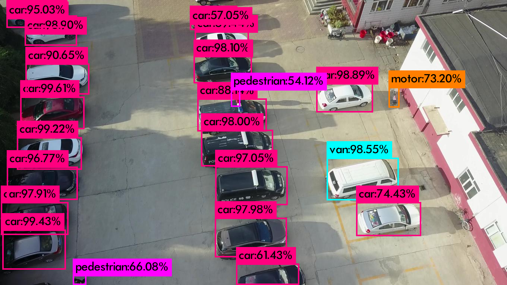
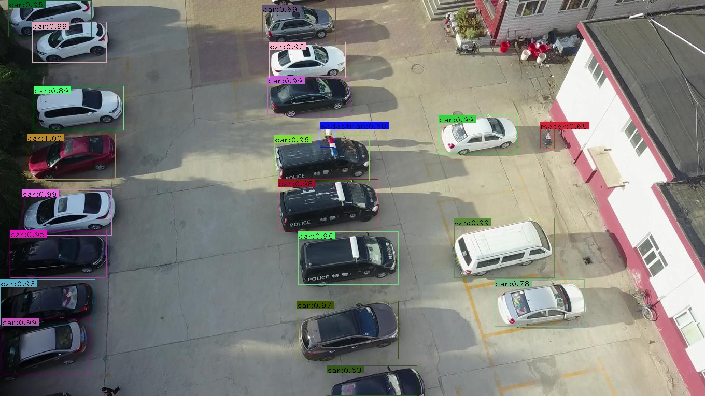
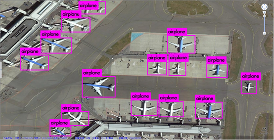
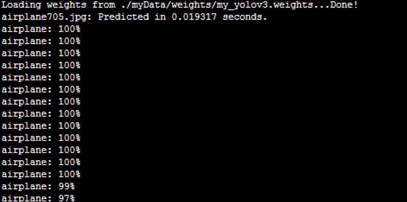
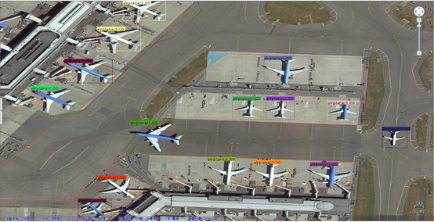
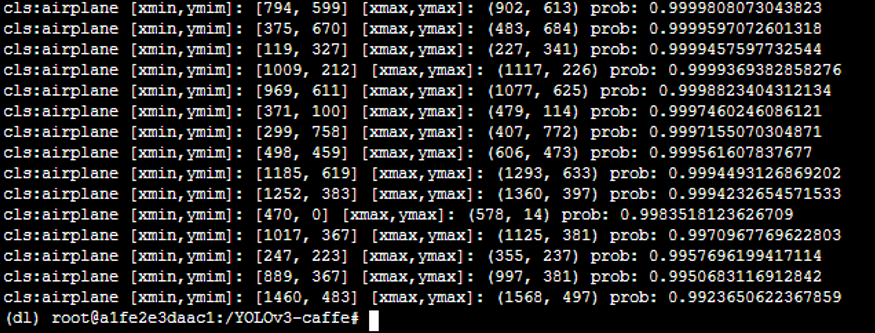

# darknet-to-caffe-s-test
Conversion of the caffemodel model required by the pre-deployment deployed in the Hisilicon 35xx series.The yolov3 model is deployed on the hi35xx series, and the RuyiStudio under the Windows system developed by HiSilicon and the nine of the Linux system developed by the company itself are both caffemodels, and then they will be converted into on-chip recognizable .wk models . So we need to convert the yolov3 model trained by darknet. In addition, the chip that uses caffemodel as the main loading model or conversion model can also use this model....

# Requirements
* Python2.7
* Pytorch >= 0.40
* Caffe1.0

# Ready
### Step1:caffe configuration 
you should join unsample layer.
Since caffe lacks the unsample layer of darknet, you need to add the corresponding unsample layer to the caffe environment and recompile.
I have put the layer to be added in caffe-add-unsample.
You only need to put `upsample_layer.hpp` in the `include/caffe/layers` under the caffe environment configuration;
`upsample_layer.cpp` and `upsample_layer.cu` are placed under `src/caffe/layers` in the caffe environment configuration.

Modify the corresponding `caffe.proto` file, and add the last line of LayerParameter in `src/caffe/proto/caffe.proto`:
```javascript
message LayerParameter {
.....
optional UpsampleParameter upsample_param = 150;
}
```
Note that 150 is the ID number of the new layer. Please specify the ID number according to your personal caffe.proto file. If you have added some layers and named ID number 150 before, you need to change the ID number to another ID number.
Then add the parameters of the upsample layer in caffe.proto:
```javascript
message UpsampleParameter{
optional int32 scale = 1 [default = 1];
}...
```  
### Step2:Recompile caffe environment
You need to enter the command to recompile caffe：

##### 1.Clean up the compiled environment
```javascript
$ make clean
```
##### 2.Compile caffe
```javascript
$ make all -j8
```
##### 3.Compile pycaffe
```javascript
$ make pycaffe -j8
```
### Step3:The trained model
Here I have several model files that have been trained for you to try. The download address is as follows. After downloading and unzipping, copy the folder to the darknet to caffe file directory and use it.

* [Coco](https://pan.baidu.com/s/10f9Lg66spfVw_gSWv39NfA) dataset has been `trained weights model` file and `cfg configuration file`.

  Extraction code: bijy
  
* [Visdrone](https://pan.baidu.com/s/1N-71i2TjPQyYDb5aBEUM6Q) dataset has been `trained weights model` file and `cfg configuration file`.

  Extraction code: trdx

* [Bdd100K](https://pan.baidu.com/s/1JdoXMn8d_4vnRBzkUdq2Iw) dataset has been `trained weights model` file and `cfg configuration file`.

  Extraction code: 5ur3

* [DIOR](https://pan.baidu.com/s/1V3Jc8WX4bRn46UZD3xbDwQ) dataset has been `trained weights model` file and `cfg configuration file`.

  Extraction code: y26i
  
## Demo one - darknet to caffe
```javascript
$ python cfg[in] weights[in] prototxt[out] caffemodel[out]
```  
## Example one - darknet to caffe
```javascript
$ python cfg/yolov3.cfg weights/yolov3.weights prototxt/yolov3.prototxt caffemodel/yolov3.caffemodel
```
## Demo two - darknet to caffe's test
You need to modify the caffe environment in detect_one.py to your own installation environment, and modify the inp_dim and num_classes in utils.py to the values suitable for your data size and category.
```javascript
$ python detect_one.py --prototxt=[in] --caffemodel=[in] --classfile=[in] --image==[in] --resolution==[out]
```
## Example two - darknet to caffe's test
```javascript
$ python detect_one.py --prototxt=model/yolov3.prototxt --caffemodel=model/yolov3.caffemodel --classfile=model/coco.names --image==images/dog-cycle-car.png --resolution==416
```

# Test visualization results
### Visdrone  results
Visdrone darknet:


visdrone caffe:



### My airport data results
Airplane darknet:




Airpalne caffe:




# Test index
# Reference
Thanks for the following items.

* [ChenYingpeng](https://github.com/ChenYingpeng/darknet2caffe) 
* [jasonlovescoding](https://github.com/JiQiqLiu/darknet-to-caffe-s-test)
